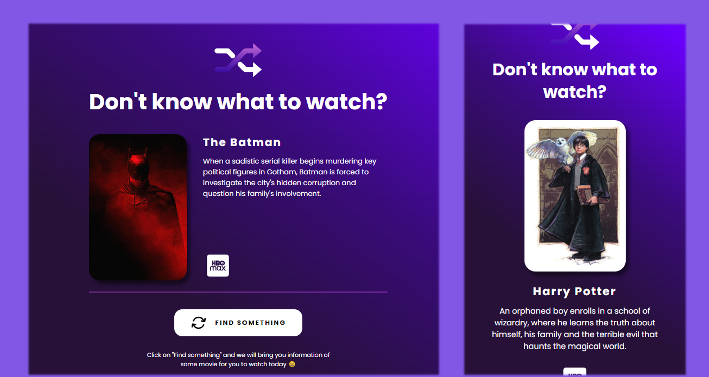

<h1 align='center'>
MoviePick
</h1>

<h1 align='center'>
  
</h1>
<h1 align='center'><a href="">See the site</a></h1>

## 📕 About

Project to practice JavaScript and DOM manipulation. 
Display a random movie every time you click "Find Something" 

Yet to implement: 

- Use themoviedb.org API to display a random movie. 

Users should be able to: 

- Receive a movie suggestion every time you click the button. 
- See the film's poster, title, synopsis and platform. 
- View the optimal layout depending on their device's screen size 

## 🔨 Tools

- HTML
- CSS
- JavaScript
